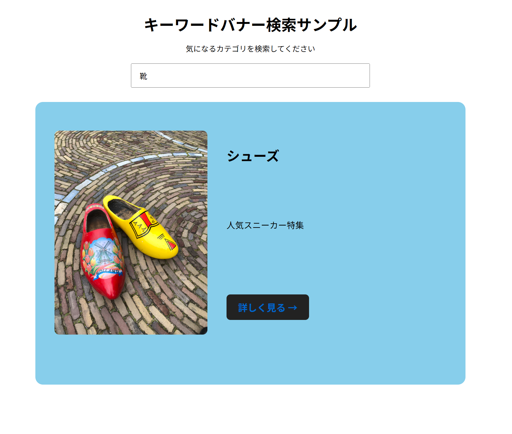

# Keyword Banner Search Sample

キーワードに応じて、商品バナーを動的に切り替えるECサイト風のWebアプリです。

## Demo

GitHub Pagesで公開しています。

https://drmsngyn-dev.github.io/keyword-banner-sample/

## Features

- キーワード入力による商品検索
- JSONデータを利用したバナーの動的表示
- 商品画像・タイトル・説明文の切り替え
- 商品詳細ページへの遷移
- 靴・バッグ・帽子の3カテゴリに対応
- PC / スマートフォンのレスポンシブ対応

## Keywords

以下のキーワードで検索できます。

- 靴
- バッグ
- 帽子

## Technologies

- HTML
- CSS
- JavaScript
- JSON
- Git / GitHub
- GitHub Pages

## Purpose

ECサイトの検索画面を想定し、
検索キーワードに応じて適切なコンテンツを表示する仕組みを
JavaScriptとJSONを使って実装しました。

レスポンシブデザインにも対応し、
PCとスマートフォンの両方で閲覧できるようにしています。

## Points

- 商品情報をJSONで管理し、表示処理とデータを分離
- 入力されたキーワードに応じてJavaScriptで表示内容を動的に変更
- PCでは横型、スマートフォンでは縦型になるレスポンシブデザインを実装
- 商品ごとに詳細ページを用意し、ECサイトを想定した画面遷移を実装
- GitHub Pagesを利用してWeb上に公開
